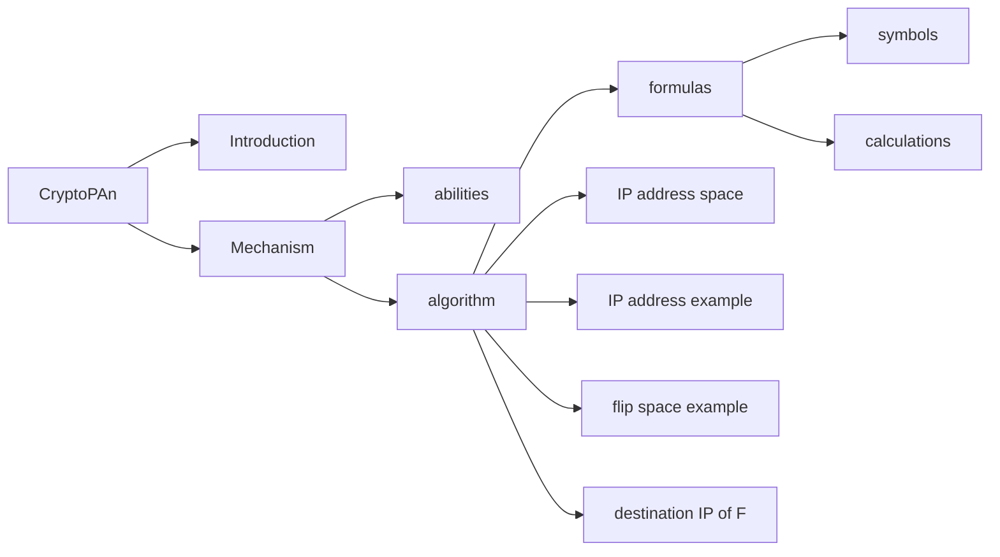

```
/**
 * Copyright 2020 JunjieZhou
 *
 * Licensed under the Apache License, Version 2.0 (the "License");
 * you may not use this file except in compliance with the License.
 * You may obtain a copy of the License at
 * 
 *     http://www.apache.org/licenses/LICENSE-2.0
 * 
 * Unless required by applicable law or agreed to in writing, software
 * distributed under the License is distributed on an "AS IS" BASIS,
 * WITHOUT WARRANTIES OR CONDITIONS OF ANY KIND, either express or implied.
 * See the License for the specific language governing permissions and
 * limitations under the License.
 */
```



- [CryptoPAn](#cryptopan)
  - [Introduction](#introduction)
  - [CryptoPAn Mechanism](#cryptopan-mechanism)
  - [Other Implementation of CryptoPAn](#other-implementation-of-cryptopan)
  - [References](#references)
  - [Project Structure](#project-structure)


# CryptoPAn

## Introduction

CryptoPAn is a prefix preserving anonymization algorithm specified for IPv4.
Network trace capture files or logs contain underlying information and can be applied into appropriate research, such as security analysis and commercial plan. However, explicit information concerning privacy issues also exists in such files, which hinders outsourcing them to a third party for the purpose of research. IP address is a typical of privacy information due to its direct reflection on host location.
To protect IP address from revealing when publish or outsource trace files, appropriate anonymization tools should be applied on IP address. Xu et. al [[1]](#references) proposed a cryptographic-based prefix-preserving scheme, so-called CryptoPAn, to anonymize IP addresses, meanwhile retaining the prefix stucture of them.
The source prototype of CryptoPAn implemented in cpp was published in Gatech website, but it is off shelf now. However, the source code are redistributed by many people and could be found in [[2][3]](#references). This project provides a java version of CryptoPAn.

## CryptoPAn Mechanism

There are powerful abilities built in CryptoPAn and corresponding. Frist, able to anonymize original IP addresses to obfuscated ones, CryptoPAn is proved to be a deterministic one-to-one mapping. It can obfuscate IP addresses and, at the same time, preserve prefix relationships among them. Besides, it ensures the prefix preserving property accurate to every single bit. 

As for its algorithms, IP address prefix properties are utilized effectively. In general, CryptoPAn generates 32 bits to operate exclusive-or with the original IP address. While the bits are not generated randomly, but generated according to the original IP address.

Here are symbols and calculations appear in CryptoPAn.

Let $F$ be a function from {0,1}$^n$ to {0,1}$^n$, here $F$ is CryptoPAn function.

Let $f_i$ be a function from {0,1}$^i$ to {0,1}, for $i = 0,1,···,n-1$ and $f_0$ is a constant. Here $f$ is the function for generating xor bits.

Given an n-bit IP address $a$, $a=a_1a_2···a_n$, $f_i=f_i(a_1a_2···a_i)=0/1$, $F_i=a^{'}_{1}a^{'}_{2}···a^{'}_{i}$. Ranging $i$ from 0 to 31, $a^{'}_{i}$=$a_{i}\oplus f_{i-1}(a_1a_2···a_{i-1})$.

[](https://imgchr.com/i/rBYdHI)

It is noted that a 32-height complete binary tree can represent the entire set of possible distinct IPv4 addresses. As [[1]](#references) has illustrated, Figure 1(a) shows a simplified IP addresses space using a complete binary tree. Figure 1(b) shows an orignial address tree including 9 IP addresses for example. According to exclusive-or properties, $f$ can be viewed as a flip function, which decides whether original bits in corresponding position will turn over or not. Similar as IP address binary tree, $f$ can also be represented as a flip tree. Figure 1(c) reveals an example of flip tree. After applying flip function (or exclusive-or) of Figure 1(b) to Figure 1(c), Figure 1(d) shows the output of 9 graphcial IP addresses under CryptoPAn.

## Other Implementation of CryptoPAn

This project provides Java version of CryptoPAn, with reference to [[2][3][4]](#references), and [[4]](#references) is a python version. Another python version supporting IPv6 is in [[5]](#references). Also, C lang version could be found in [[6]](#references) which improves AES performence. Other implementations are published in [[7][8][9][10][11][12]](#references), corresponding language are C#, Go, Perl, VHDL, Ruby, and Julia.

## References

[1]: Xu, J., Fan, J., Ammar, M. H., & Moon, S. B. (2002, November). Prefix-preserving ip address anonymization: Measurement-based security evaluation and a new cryptography-based scheme. In *10th IEEE International Conference on Network Protocols, 2002. Proceedings*. (pp. 280-289). IEEE.

[2]: *NetSniff*. Caia.swin.edu.au. (2020). Retrieved 18 December 2020, from http://caia.swin.edu.au/ice/tools/netsniff/.

[3]: *certtools/cryptopanlib*. GitHub. (2020). Retrieved 18 December 2020, from https://github.com/certtools/cryptopanlib.

[4]: *pycryptopan*. PyPI. (2020). Retrieved 21 December 2020, from https://pypi.org/project/pycryptopan/.

[5]: *yacryptopan*. PyPI. (2020). Retrieved 21 December 2020, from https://pypi.org/project/yacryptopan/.

[6]: Lab, I. (2020). *cryptopANT IP Address Anonymization Library*. Ant.isi.edu. Retrieved 21 December 2020, from https://ant.isi.edu/software/cryptopANT/index.html.

[7]: *UniStuttgart-VISUS/Sappan.CryptoPAn*. GitHub. (2020). Retrieved 21 December 2020, from https://github.com/UniStuttgart-VISUS/Sappan.CryptoPAn.

[8]: *Yawning/cryptopan*. GitHub. (2020). Retrieved 21 December 2020, from https://github.com/Yawning/cryptopan.

[9]: Kristoff, J. (2020). *IP::Anonymous - Perl port of Crypto-PAn to provide anonymous IP addresses - metacpan.org*. Metacpan.org. Retrieved 21 December 2020, from https://metacpan.org/pod/distribution/IP-Anonymous/lib/IP/Anonymous.pm.

[10]: *Overview :: Crypto-PAn :: OpenCores*. Opencores.org. (2020). Retrieved 21 December 2020, from https://opencores.org/projects/cryptopan_core.

[11]: *pwood/cryptopan*. GitHub. (2020). Retrieved 21 December 2020, from https://github.com/pwood/cryptopan.

[12]: *ovarene/CryptoPan.jl*. GitHub. (2020). Retrieved 21 December 2020, from https://github.com/ovarene/CryptoPan.jl.
